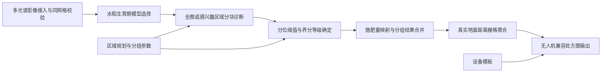
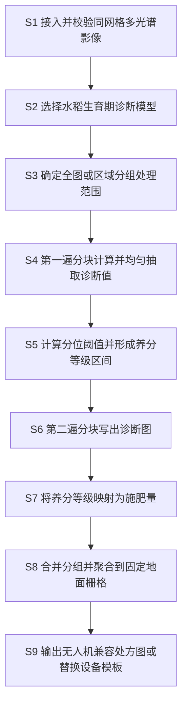

# 技术交底书

**案件名称**：一种水稻养分遥感诊断无人机精准施肥的方法

**技术联系人**：

- 姓名：待填写
- 电话：待填写
- 邮箱：待填写

**专利类型**：发明

---

## 注意事项

（1）本交底书用于说明无人机多光谱影像从输入校验、水稻养分诊断、区域分级、施肥量映射到无人机处方图输出的完整技术方案。

（2）技术公开程度以本领域普通技术人员能够依据本文和附图实施为准。涉及申请人、发明人及联系人信息的栏目暂以“待填写”标记，不影响技术方案说明。

## 一、技术背景与现有技术

### 1.1 现有技术

检索说明：在国家知识产权局专利公布公告系统和 Google Patents 公开专利文本中，以“水稻变量施肥”“无人机多光谱”“养分诊断”“施肥处方图”和“地面栅格”等为检索词进行检索，并对 A01C21、G06V20、G01N21 等分类方向的公开文本进行核对。

#### 1.1.1 水稻多光谱诊断与追肥处方

中国专利申请 CN121866950A 公开了一种水稻变量施肥方法、装置、电子设备及存储介质。该方案对多光谱遥感图像剔除非稻株干扰物，提取并融合稻株冠层多维特征，利用长势等级预测模型得到预测长势等级，经标准化后确定氮肥调整因子并调整标准施氮量。该方案适用于水稻施氮量推荐，但其重点在冠层掩膜、多维特征融合和等级预测，未公开四路单波段同网格输入前置校验、八个生育期的诊断模型路由、区域分组独立分位阈值、全图蓄水池均匀抽样和按真实地面距离构建处方栅格的组合机制。来源链接：http://epub.cnipa.gov.cn/patent/CN121866950A

中国专利申请 CN116602106A 公开了一种基于无人机的水稻田内变量施肥方法。该方案利用无人机多光谱影像、植株氮积累量监测模型、潜在产量预测模型和氮肥优化算法生成纯氮推荐用量处方图，再按照撒肥平台精度重采样至 3 m，并换算为尿素追肥处方图。该方案适用于水稻关键生育期的田内变量追肥，但其技术重点在氮肥优化模型和田间试验参数，未公开四路单波段影像的同网格校验、不同区域分别形成分位诊断阈值、全图无空间偏置抽样以及按任意源坐标系真实地面距离形成可配置目标栅格的组合机制。来源链接：https://patents.google.com/patent/CN116602106A/zh

中国专利 CN111670668B 公开了基于高光谱遥感处方图的水稻农用无人机精准追肥方法。该方案围绕寒地水稻关键生育期，利用高光谱遥感反演氮素含量并形成追肥处方，适用于分蘖期等追肥场景。该方案依赖高光谱数据和相应反演建模，未公开针对绿光、红光、近红外等单波段正射影像的多生育期模型路由，也未公开面向超大地理栅格的两遍分块诊断与设备兼容输出。来源链接：https://patents.google.com/patent/CN111670668B/zh

中国专利申请 CN112903600A 及其授权文本 CN112903600B 公开了一种基于固定翼无人机多光谱影像的水稻氮肥推荐方法。该方案构建水稻植株氮积累量监测模型，拟合无人机时序光谱动态曲线，并利用充足指数算法给出氮肥推荐量，适用于水稻追肥关键生育期。其重点是敏感植被指数筛选、曲线拟合和氮肥推荐，没有形成从输入影像完整性、区域分组分级到处方栅格设备格式的一体化处理链。来源链接：https://patents.google.com/patent/CN112903600B/zh

#### 1.1.2 作物变量施肥与无人机执行

中国专利申请 CN113298859A 公开了一种基于无人机影像的作物氮肥变量管理方法，通过无人机影像的光谱与纹理特征构建氮素营养指数并进行变量施肥，用于降低单一光谱饱和和固定施肥等级带来的误差。该方案重点解决光谱与纹理特征融合问题，未公开针对水稻八个生育阶段选择不同指数与诊断模型，也未公开在多个互斥感兴趣区域组内分别确定分位阈值并合并处方图。来源链接：https://patents.google.com/patent/CN113298859A/zh

中国专利申请 CN112269400A 公开了一种无人机精准变量施肥方法及系统。该方案由无人机搭载光谱相机获取遥感图像，匹配标准长势模型后生成需肥量处方图和航点规划图，并结合肥料落地时间、飞行位置及处方量提前生成排肥控制指令。该方案重点在飞行作业、航点预判和排肥控制，对营养诊断分级及处方栅格生成的内部处理相对概括。来源链接：https://patents.google.com/patent/CN112269400A/zh

综上，现有技术已公开“无人机遥感—作物诊断—变量施肥”的总体思路。本发明的本质区别不在于简单拼接上述环节，而在于建立同一地理网格上的可验证数据入口，按水稻生育期路由诊断模型，在全图或区域分组内采用无空间偏置抽样确定分位阈值，并通过两遍分块处理生成施肥量栅格，最终按真实地面距离聚合为无人机可读取的处方图，从而把诊断可靠性、大影像可处理性、田块内部差异和作业设备兼容性统一到一个闭环流程中。

### 1.2 现有技术存在的缺点

1. 部分方案把合成预览图或未经严格校验的多波段数据直接用于诊断。当预览图的蓝光或透明度通道被误作红光或近红外通道时，诊断结果失去物理意义。
2. 单一生育期或固定指数难以覆盖水稻从幼苗期到成熟期的生理差异；固定等级边界也难以适应同一批影像中不同田块、品种或管理区域的相对长势差异。
3. 直接从影像起始位置截取有限样本会使阈值偏向影像一侧；整图读入又容易在大幅正射影像上造成内存溢出。
4. 以像素个数进行简单池化不能保证输出像元对应固定地面尺寸，尤其在经纬度坐标系或非米制投影下会导致处方格大小随纬度、分辨率和坐标单位变化。
5. 通用地理栅格与无人机作业平台之间常存在文件结构、无效值、世界文件和模板网格不兼容的问题，增加了处方图导入失败或空间错位风险。

## 二、本发明所要解决的技术问题

本发明拟解决以下相互关联的技术问题：

1. 如何确保参与养分诊断的多光谱影像确实对应红边、绿光、红光和近红外通道，并位于相同尺寸、坐标参考和仿射网格上；
2. 如何根据水稻生育期选择相应植被指数和诊断模型，并根据全图或指定区域内的数据分布自适应确定诊断等级；
3. 如何在不把超大影像整体装入内存的前提下，避免有限样本集中于影像局部造成的阈值偏差；
4. 如何把诊断等级稳定转换为施肥量，并按真实地面距离形成固定宽度的无人机处方格；
5. 如何输出与无人机作业平台兼容的处方文件，并在需要时将处方量替换到设备模板网格而保留模板结构。

## 三、本发明技术方案的详细阐述

### 3.1 应用场景与术语

本发明适用于利用无人机获取水稻田多光谱正射影像并生成变量施肥处方图的场景。参与者包括执行影像采集和施肥作业的无人机、用于生成多光谱正射影像的测绘处理端、用于营养诊断和处方计算的处理系统，以及接收处方图或模板文件的无人机作业平台。

多光谱影像以四张单波段地理栅格进入处理系统：红边通道记为 B1，绿光通道记为 B2，红光通道记为 B3，近红外通道记为 B4；另可提供一张整体预览图，但预览图仅用于浏览和划定感兴趣区域，不参与诊断计算。系统按文件名关键字识别通道，其中先识别 RedEdge 再识别 Red，避免字符串包含关系导致误判。

“感兴趣区域”是用户在预览图上以经纬度点划定的水稻田区域；系统将乱序点重排为最小凸包，再换算到诊断网格像素坐标。“区域分组”是一个或多个互斥感兴趣区域的集合，每个分组可具有独立的分位断点、长势标签和施肥映射。“地面栅格”是以米为单位定义目标像元宽度，并根据源坐标系在影像中心附近的真实地面距离换算得到的输出网格。

### 3.2 系统框图

### 3.3 模块功能说明

1. **多光谱影像接入与同网格校验模块**：识别 B1 至 B4 及预览图；检查必需通道是否齐全、各通道是否为单波段、宽高是否一致、坐标参考是否一致以及仿射变换是否在容差内一致。任一必需条件不满足时停止诊断，预览图不一致仅提示而不影响诊断。
2. **水稻生育期模型选择模块**：接收幼苗期、分蘖期、拔节期、孕穗期、抽穗期、扬花期、成熟期前或成熟期标识，选择对应的植被指数、诊断指标、诊断模型和分位断点。
3. **区域规划与分组参数模块**：将用户标注的经纬度点重排为凸包，拒绝落入既有区域内部的新点；把凸包换算到诊断网格，并允许将互斥区域组成多个分组。未分组区域使用全局参数。
4. **分块诊断模块**：按预设块宽和块高读取 B2、B3、B4，取三个通道有效掩膜的交集；在第一遍处理时计算诊断值并进行全图蓄水池均匀抽样，在第二遍处理时依据阈值写出诊断等级图和诊断值图。
5. **分位阈值与养分等级模块**：在全图、感兴趣区域或区域分组内对有效诊断值求分位数，形成各等级的左开右闭区间；成熟期前和成熟期采用四级，其余阶段采用五级。区域外或无效像元保持无效值。
6. **施肥量映射与合并模块**：把诊断等级按公式模式或手动模式映射为 kg/亩施肥量；不同区域分组分别诊断和映射后，以有限值或非无效等级为准，分块合并到同一地理网格。
7. **地面栅格聚合模块**：把源坐标系中心点转换到当地 UTM 分区，测量横纵坐标单位对应的真实地面米数，将用户指定的目标宽度换算为源坐标单位，并使用面积平均方式把有效源像元聚合到固定地面栅格，NaN 不参与平均。
8. **无人机兼容输出模块**：输出单波段 float32、条带存储、deflate 压缩的处方图，无效像元写为 NaN，不写 NoData 标签和内嵌坐标系，另写同名世界文件；当提供设备模板时，将处方图重采样到模板网格并保留模板标签、波段说明和彩色表。

### 3.4 系统流程说明

**S1，接入并校验同网格多光谱影像。** 系统先按文件名识别 B1、B2、B3、B4 和预览图，检查 B1 至 B4 是否齐全且均为单波段；以 B2 网格为基准，核对宽高、坐标参考和仿射变换。只有全部通道处于同一网格时才进入后续处理。

**S2，选择水稻生育期诊断模型。** 根据用户选择的生育期，从配置中取得该阶段对应的植被指数函数、诊断函数、诊断指标及分位断点。该步骤使同一处理链可以覆盖八个水稻生育阶段。

**S3，确定全图或区域分组处理范围。** 全图模式不附加区域掩膜；区域模式将经纬度凸包转换成像素坐标，并在每个读取窗口内以像元中心执行扫描线偶奇填充。若存在区域分组，则为每组建立独立的阈值和施肥映射参数。

**S4，第一遍分块计算并均匀抽取诊断值。** 系统以预设块尺寸流式读取 B2、B3、B4，计算植被指数和诊断值，并与通道有效掩膜、区域掩膜求交。样本数未设上限时收集全部有效值；设有上限时，以固定随机种子执行蓄水池抽样，使已遍历的每个有效诊断值具有相同的保留概率。

**S5，计算分位阈值并形成养分等级区间。** 对第一遍获得的样本按各阶段预设分位点求断点。每一等级使用前一断点到当前断点的区间，最后一级覆盖到最大值。分组模式下，各组独立计算，因此可适应不同田块或管理区的相对长势分布。

**S6，第二遍分块写出诊断图。** 系统再次流式读取影像并计算诊断值，根据步骤 S5 的区间确定等级，分别写出 uint8 诊断等级图和可选的 float32 诊断值图；区域外和无效像元分别写为 255 和 NaN，同时统计等级像元数与诊断值范围。

**S7，将养分等级映射为施肥量。** 公式模式根据基准等级、基准施肥量和变化系数计算每级施肥量；手动模式读取各等级给定值。系统分块读取诊断等级图并输出单波段施肥量栅格，未匹配等级写为 NaN。

**S8，合并分组并聚合到固定地面栅格。** 区域分组结果先在相同网格上按有效像元合并。随后系统测量源坐标单位对应的真实地面距离，把目标地面宽度换算为横纵像元尺寸，以源影像左上角为原点、向上取整覆盖原范围，并采用面积平均或最近邻重采样生成固定地面栅格。

**S9，输出无人机兼容处方图或替换设备模板。** 默认输出不含内嵌坐标系和 NoData 标签的 float32 GeoTIFF 及同名 TFW 文件，并输出阈值、映射、网格和统计元数据。若用户提供无人机设备模板，则依据双方是否具备坐标系选择重投影或仿射网格匹配，把有效处方量写入模板第一波段，并保留模板其余结构。

### 3.4.1 符号与公式

符号定义如下：(s) 表示水稻生育期；(B_2)、(B_3)、(B_4) 分别表示绿光、红光和近红外通道；(I_s) 表示生育期 (s) 对应的植被指数；(D_s) 表示对应诊断值；(i) 表示诊断等级；(Q_i) 表示等级 (i) 的施肥量；(Q_b) 和 (b) 分别表示基准施肥量和基准等级；(k) 表示相邻等级变化系数；(R) 表示目标地面栅格宽度；(m_x)、(m_y) 表示源坐标系横纵方向一个坐标单位对应的地面米数；(r_x)、(r_y) 表示目标栅格在源坐标系中的横纵像元尺寸。

按生育期选择植被指数和诊断模型的关系为：

\[I_s=f_s(B_2,B_3,B_4) \tag{1}\]

\[D_s=g_s(I_s) \tag{2}\]

其中，(f_s) 和 (g_s) 由生育期选择。源项目中的具体关系如下表所示。

| 生育期 | 植被指数 (I_s) | 诊断值 (D_s) | 等级分位点 |
|---|---|---|---|
| 幼苗期 | SAVI=1.10×(B4-B3)/(B4+B3+0.1) | SPAD=95.7×SAVI+18.4 | 0.1、0.3、0.7、0.9、1.0 |
| 分蘖期 | OSAVI=1.16×(B4-B3)/(B4+B3+0.16) | AGB=2845.6×OSAVI²-2953.2×OSAVI+987.5 | 0.1、0.3、0.7、0.9、1.0 |
| 拔节期 | OSAVI=1.16×(B4-B3)/(B4+B3+0.16) | biomass=26.107^(2.6114×OSAVI) | 0.1、0.3、0.7、0.9、1.0 |
| 孕穗期 | RVI=B4/B3 | LAI=-0.7375×RVI+9.6073 | 0.1、0.3、0.7、0.9、1.0 |
| 抽穗期 | NDVI=(B4-B3)/(B4+B3) | LAI=2.8339×exp(1.3655×NDVI) | 0.1、0.3、0.7、0.9、1.0 |
| 扬花期 | NRI=(B2-B3)/(B2+B3) | LAI=-7.354×NRI+7.9181 | 0.1、0.3、0.7、0.9、1.0 |
| 成熟期前 | DVI=B4-B3 | 理论产量=0.3878×DVI-195.83 | 0.25、0.6、0.9、1.0 |
| 成熟期 | RVI=B4/B3 | 实际产量=-48.304×RVI²+518.11×RVI-528.44 | 0.25、0.6、0.9、1.0 |

施肥量公式为：

\[Q_i=Q_b[1+(b-i)k] \tag{3}\]

式（3）使较低长势等级相对于基准等级增加施肥量、较高长势等级相对于基准等级减少施肥量。手动映射模式可替代式（3），但必须为该生育期的每一等级提供施肥量。

目标地面栅格换算关系为：

\[r_x=R/m_x,\quad r_y=R/m_y \tag{4}\]

系统先在影像中心附近通过源坐标系到本地 UTM 的转换测量 (m_x) 和 (m_y)，再使用式（4）得到源坐标单位下的目标像元尺寸，从而避免把“若干源像素”错误等同于固定地面米数。

### 3.5 关键技术参数

| 参数 | 符号 | 项目实现值或约束 | 作用 |
|---|---|---|---|
| 分块边长 | 无 | 默认 1024 像元，最小 64 像元 | 控制单次内存占用 |
| 分位样本上限 | 无 | 默认 2,000,000，0 表示全量 | 控制阈值统计内存 |
| 抽样随机种子 | 无 | 20240101 | 保证蓄水池抽样可复现 |
| 诊断等级无效值 | 无 | 255 | 标识通道无效或区域外像元 |
| 施肥量无效值 | 无 | NaN | 使无效像元不参与平均聚合 |
| 基准等级 | (b) | 默认 3 | 施肥映射基准 |
| 基准施肥量 | (Q_b) | 默认 10 kg/亩 | 施肥映射基准 |
| 等级变化系数 | (k) | 默认 0.025 | 调节相邻等级差异 |
| 目标地面栅格宽度 | (R) | 默认 1 m，处理界面约束不低于 1 m | 决定无人机处方格尺寸 |
| 重采样方法 | 无 | 默认 average，可选 nearest | 面积平均或最近邻 |
| 仿射变换比较容差 | 无 | 逐元素相对容差 1×10^-9 | 判定四路影像是否同网格 |
| 输出数据类型 | 无 | float32 | 平衡数值精度和设备兼容性 |

## 四、与现有技术相比的优点

1. **从数据入口阻断错误诊断。** 四路单波段影像必须同时满足角色、波段数、尺寸、坐标参考和仿射网格一致性，预览图与诊断通道严格分离，能够避免把合成图的蓝光或透明度通道误用于养分计算。
2. **适应完整水稻生育过程。** 同一流程按八个生育期选择不同指数、诊断指标和模型，成熟前后还可改变分级数量，避免单一植被指数覆盖所有阶段。
3. **兼顾田块内部差异和结果可复现性。** 全图、单个感兴趣区域及多个区域分组均可独立计算分位阈值；有限样本采用固定随机种子的蓄水池抽样，避免样本集中于影像左上角。
4. **可处理超大正射影像。** 诊断、处方写出和分组合并均按窗口流式执行，诊断采用先统计后写出的两遍处理，避免整幅影像在内存中长期驻留。
5. **处方格具有真实地面尺度。** 目标像元以米为单位，通过源坐标系到当地 UTM 的距离量测换算，适用于经纬度坐标系和不同投影单位；面积平均时 NaN 不参与聚合。
6. **面向实际无人机作业链。** 输出格式和无效值表达适配无人机处方图，并可将有效处方量写入既有设备模板而保留模板标签和彩色表，减少导入失败和空间错位。

## 五、本发明的技术关键点和欲保护点

1. 对红边、绿光、红光和近红外四张单波段影像进行角色识别，并以同一尺寸、坐标参考和仿射变换为诊断前置条件，同时把整体预览图排除在诊断计算之外。
2. 根据水稻生育期从多组植被指数、诊断函数、分位断点和等级数量中选择对应组合，在同一处理链内生成水稻养分或长势诊断值。
3. 在全图、感兴趣区域或区域分组内执行第一遍分块计算，以蓄水池抽样或全量统计形成诊断样本，按分位点生成等级区间，再执行第二遍分块分类与写出。
4. 将乱序经纬度点重排为凸包并转换到诊断网格，在各读取窗口内按像元中心进行扫描线栅格化，使区域掩膜无需整图驻留内存；多个互斥分组分别诊断后再按同网格有效值合并。
5. 按公式模式或手动模式把诊断等级映射为施肥量，并对缺少映射的有效等级写无效值和生成告警统计。
6. 在源坐标系中心附近测量坐标单位对应的地面距离，把目标米制宽度转换为源坐标单位后构建覆盖原范围的输出网格，以面积平均方式聚合有效处方量。
7. 将处方图输出为单波段浮点栅格及世界文件，或者重采样到无人机设备模板网格，并保留模板结构而仅替换有效处方区域。
8. 一种实现上述方法的水稻养分遥感诊断与无人机精准施肥系统，其模块与 3.3 所述处理链对应。

## 六、其它

### 6.1 实施例一：全田分蘖期变量追肥

无人机完成同一田块的红边、绿光、红光和近红外正射影像采集。处理系统识别四个通道并完成同网格校验，用户选择分蘖期和全图模式。系统以 1024 像元为分块边长，第一遍计算 OSAVI 和 AGB 诊断值，以最多 2,000,000 个样本进行固定种子蓄水池抽样，按 0.1、0.3、0.7、0.9、1.0 分位点形成五个等级。第二遍写出诊断等级图，再以 (b=3)、(Q_b=10) kg/亩、(k=0.025) 计算施肥量。例如一级施肥量为 10.5 kg/亩，三级为 10 kg/亩，五级为 9.5 kg/亩。最后以 (R=1) m 进行面积平均聚合并输出处方图。上述数值仅为本项目中的实施例，不作为权利要求限制。

### 6.2 实施例二：多个管理区分别诊断后合并

用户在预览图上分别圈定两个互不重叠的水稻管理区，并把每个管理区设为独立分组。系统将经纬度点重排为凸包并换算为诊断网格坐标。第一组使用全局公式施肥映射，第二组使用人工给定的逐级施肥量。系统在每个分组内分别执行两遍分块诊断，分别计算分位阈值，以适应两个区域的长势分布差异；随后将两个分组的诊断等级图、诊断值图和施肥量图按有效像元合并。未被任何分组覆盖的区域保持无效值或按预设的全局组处理。

### 6.3 实施例三：设备模板替换分支

当无人机平台要求使用其导出的处方模板时，系统读取已生成的地面栅格处方图和设备模板。双方均有坐标系时，使用坐标变换和面积平均或最近邻方式重采样；缺少坐标系但具有可用北向上仿射变换时，依据模板像元覆盖的源窗口进行分块平均或最近邻查表。系统仅在处方图有效区域替换模板第一波段，保留模板的其它波段、数据集标签、波段标签、波段说明和彩色表，并重新生成世界文件。若模板范围与处方图没有有效重叠，系统停止输出并提示空间范围错误。

### 6.4 边界条件

当必需通道缺失、某通道不是单波段、四路网格不一致、感兴趣区域没有有效像元、源影像缺少用于地面距离换算的坐标系、目标栅格像元数超过安全上限或设备模板与处方图不重叠时，系统停止相应步骤并返回明确错误，不以默认值继续产生可能错误的处方图。
