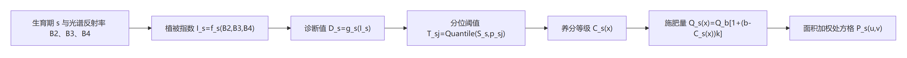

# 技术交底书

**案件名称**：一种水稻养分遥感诊断无人机精准施肥的方法

**技术联系人**：姓名、电话、邮箱均待填写

**专利类型**：发明

## 一、技术背景与现有技术

无人机多光谱遥感可以获得水稻冠层在绿光、红光和近红外波段的反射信息。现有水稻变量施肥方案通常利用植被指数或长势预测模型估计氮素、生物量、叶面积指数或产量，再按若干等级给出施肥建议。然而，不同生育期的冠层结构和光谱响应不同，同一指数或同一反演方程难以覆盖水稻从幼苗期至成熟期的变化；直接采用固定诊断阈值还会忽略当季田块、品种和管理区之间的分布差异。

中国专利申请 CN121866950A 公开了根据水稻冠层多维特征预测长势等级并确定氮肥调整因子的方案；CN116602106A 公开了利用无人机多光谱影像、植株氮积累量监测模型和氮肥优化算法生成水稻变量施肥处方图的方案；CN112903600A 及其授权文本公开了基于固定翼无人机多光谱影像的水稻氮肥推荐方法。上述方案说明了遥感诊断与变量施肥之间的总体关系，但尚需形成一套可直接计算的公式体系，使生育期、光谱指数、养分诊断量、相对等级、施肥量和地面处方格在同一数学链条中连续转换。

现有方法主要存在以下不足：一是生育期与诊断公式之间缺少明确路由，容易把某一时期建立的模型用于其他时期；二是养分诊断值与等级之间常采用固定经验界限，难以适应当前田块的实际分布；三是诊断等级到施肥量的转换缺少可配置、可复算的数学关系；四是以源影像像素数直接池化处方图时，所得处方格不一定具有固定的真实地面尺寸；五是无效像元参与聚合可能稀释田块有效区域的施肥量。

## 二、本发明所要解决的技术问题

本发明要解决的核心问题是：如何建立从无人机多光谱反射率到水稻养分诊断值、从诊断值到相对养分等级、从养分等级到单位面积施肥量、再从高分辨率施肥量到固定地面尺寸处方格的连续公式方法。

具体包括：

1. 根据水稻生育期选取对应的植被指数公式和养分或长势诊断公式；
2. 利用当前诊断范围内的诊断值分布确定自适应分位阈值，并据此形成养分等级；
3. 用统一的等级—施肥量公式或逐级给定值生成像元级施肥量；
4. 将目标处方格的米制宽度换算成源坐标单位，并对落入目标格内的有效施肥量进行面积加权聚合；
5. 保证公式计算只作用于有效且空间对应的光谱像元，无效值不进入阈值统计和处方量平均。

## 三、本发明技术方案的详细阐述

### 3.1 变量及总体公式链

设水稻生育期为 \(s\)，绿光、红光和近红外波段反射率分别为 \(B_2(x)\)、\(B_3(x)\) 和 \(B_4(x)\)，其中 \(x\) 表示地理位置对应的源影像像元。对每一生育期，先选择植被指数函数 \(f_s\)，再选择诊断函数 \(g_s\)：

\[I_s(x)=f_s\left(B_2(x),B_3(x),B_4(x)\right) \tag{1}\]

\[D_s(x)=g_s\left(I_s(x)\right) \tag{2}\]

式中，\(I_s(x)\) 为生育期 \(s\) 对应的植被指数，\(D_s(x)\) 为对应的水稻养分、长势或产量诊断值。式（1）和式（2）将“生育期选择”转化为函数对 \((f_s,g_s)\) 的选择，而不是仅改变界面标签。

对诊断范围 \(\Omega\) 内的有效诊断值集合求分位阈值，得到养分等级 \(C_s(x)\)；再把等级转换为单位面积施肥量 \(Q_s(x)\)，最后聚合成目标地面处方格 \(P_s(u,v)\)。因此总体关系为：

\[I_s=f_s(B_2,B_3,B_4),\quad D_s=g_s(I_s),\quad C_s\mapsto Q_s\mapsto P_s \tag{3}\]

### 3.2 生育期养分诊断公式

八个水稻生育期采用下表所列公式。分母采用不小于预设正数 \(\varepsilon\) 的安全除法，以避免零分母；本实施例中 \(\varepsilon=10^{-6}\)。

| 生育期 | 植被指数公式 | 诊断公式 | 诊断含义 |
|---|---|---|---|
| 幼苗期 | SAVI=1.10×(B4-B3)/(B4+B3+0.1) | D=95.7×SAVI+18.4 | SPAD相关诊断值 |
| 分蘖期 | OSAVI=1.16×(B4-B3)/(B4+B3+0.16) | D=2845.6×OSAVI²-2953.2×OSAVI+987.5 | 地上生物量 |
| 拔节期 | OSAVI=1.16×(B4-B3)/(B4+B3+0.16) | D=26.107^(2.6114×OSAVI) | 生物量 |
| 孕穗期 | RVI=B4/B3 | D=-0.7375×RVI+9.6073 | 叶面积指数 |
| 抽穗期 | NDVI=(B4-B3)/(B4+B3) | D=2.8339×exp(1.3655×NDVI) | 叶面积指数 |
| 扬花期 | NRI=(B2-B3)/(B2+B3) | D=-7.354×NRI+7.9181 | 叶面积指数 |
| 成熟期前 | DVI=B4-B3 | D=0.3878×DVI-195.83 | 理论产量 |
| 成熟期 | RVI=B4/B3 | D=-48.304×RVI²+518.11×RVI-528.44 | 实际产量 |

上述公式按生育期成对调用。例如，分蘖期先由 OSAVI 公式计算像元指数，再代入二次多项式得到地上生物量诊断值；抽穗期先计算 NDVI，再代入指数函数得到叶面积指数诊断值。绿光、红光和近红外影像应具有相同尺寸、坐标参考和仿射变换，只有三路像元同时有效时才计算 \(I_s(x)\) 和 \(D_s(x)\)。红边影像可作为多光谱数据完整性校验通道，但不强制代入上述八组现有模型。

### 3.3 自适应分位阈值和养分等级

设诊断范围 \(\Omega\) 内有效诊断样本集合为

\[S_s=\{D_s(x)\mid x\in\Omega,\;x\text{为有效像元}\} \tag{4}\]

给定递增分位点 \(0<p_{s,1}<p_{s,2}<\cdots<p_{s,L_s}=1\)，第 \(j\) 个阈值为

\[T_{s,j}=\operatorname{Quantile}(S_s,p_{s,j}) \tag{5}\]

其中，幼苗期至扬花期采用五级，分位点为 0.1、0.3、0.7、0.9、1.0；成熟期前和成熟期采用四级，分位点为 0.25、0.6、0.9、1.0。令 \(T_{s,0}=-\infty\)，则像元养分等级为

\[C_s(x)=j,\quad T_{s,j-1}<D_s(x)\le T_{s,j},\quad j=1,2,\ldots,L_s \tag{6}\]

最低等级覆盖不大于第一阈值的有效值，最高等级覆盖最后一个有限阈值以上直至样本最大值。若划分多个互斥管理区 \(\Omega_h\)，则分别构造 \(S_{s,h}\)、\(T_{s,h,j}\) 和 \(C_{s,h}(x)\)，使每个管理区依据自身诊断值分布形成等级，而不是共用全田固定阈值。

当有效像元数大于样本容量 \(N_{max}\) 时，采用蓄水池抽样近似 \(S_s\)。遍历到第 \(n\) 个有效诊断值时，以

\[\Pr\{D_s(x_n)\text{保留}\}=\min\left\{1,\frac{N_{max}}{n}\right\} \tag{7}\]

决定其是否进入样本池；采用固定随机种子可以复现阈值。该抽样使已遍历的每个有效诊断值具有相同保留概率，避免按影像读取顺序截取前 \(N_{max}\) 个值所造成的空间偏置。

### 3.4 等级到施肥量的转换公式

设基准等级为 \(b\)，基准施肥量为 \(Q_b\)，相邻等级变化系数为 \(k\)，则第 \(i\) 级对应的施肥量为

\[Q_i=Q_b\left[1+(b-i)k\right] \tag{8}\]

像元级施肥量为

\[Q_s(x)=Q_{C_s(x)} \tag{9}\]

式（8）中，较低等级对应较大的补偿施肥量，较高等级对应较小的施肥量。以五级诊断、\(b=3\)、\(Q_b=10\ \mathrm{kg/亩}\)、\(k=0.025\) 为例，第1至第5级施肥量依次为 10.5、10.25、10、9.75 和 9.5 kg/亩。若已有农艺试验给出逐级施肥量，可将式（8）替换为查表关系 \(Q_i=q_i\)，但必须为该生育期全部有效等级提供对应值。

对于多个管理区，先分别依据各区阈值计算 \(C_{s,h}(x)\) 和 \(Q_{s,h}(x)\)，再按互斥区域掩膜合并：

\[Q_s(x)=\sum_{h=1}^{H}J_h(x)Q_{s,h}(x) \tag{10}\]

式中，\(J_h(x)\) 为区域指示函数；未被任何管理区覆盖的位置保持无效，或按预设的全局诊断关系处理。

### 3.5 固定地面栅格处方图的构造公式

设目标处方格的真实地面边长为 \(R\) 米，源坐标系横、纵方向一个坐标单位分别对应 \(m_x\) 和 \(m_y\) 米，则目标格在源坐标系中的横、纵像元尺寸为

\[r_x=\frac{R}{m_x},\qquad r_y=\frac{R}{m_y} \tag{11}\]

其中，\(m_x\) 和 \(m_y\) 通过影像中心附近从源坐标系到当地通用横轴墨卡托投影分区的距离量测得到。由此，无论源数据采用经纬度单位、米制投影或其他投影单位，目标处方格均对应 \(R\times R\) 平方米的地面范围。

设目标处方格 \(G_{u,v}\) 与源像元 \(x\) 的重叠面积为 \(a_{x,u,v}\)，目标格内有效源像元集合为 \(V_{u,v}\)，则面积平均处方量为

\[P_s(u,v)=\frac{\sum_{x\in V_{u,v}}a_{x,u,v}Q_s(x)}{\sum_{x\in V_{u,v}}a_{x,u,v}} \tag{12}\]

无效值不进入式（12）的分子和分母。若 \(V_{u,v}\) 为空，则该目标格写为非数值。目标格总施肥质量可按下式统计：

\[M=\frac{R^2}{666.6667}\sum_{(u,v)\in V_G}P_s(u,v) \tag{13}\]

式中，\(V_G\) 为有效目标格集合，\(M\) 的单位为 kg。式（13）利用一亩约为 666.6667 m²，把 kg/亩转换为每个目标格的肥料质量并求和。

### 3.6 计算边界与数据组织

诊断公式、阈值统计和处方计算按影像窗口执行。第一遍计算式（1）至式（5），得到诊断样本和阈值；第二遍重新计算式（1）和式（2），再按式（6）至式（10）写出等级图和施肥量图。两遍计算的目的在于先获得全局或区域阈值，再对所有像元作一致分类，并非本发明的主要保护对象。

参与公式计算的光谱影像须为同一地理网格；输入无效像元、区域外像元、分母异常像元及未匹配等级均写为无效值。处方图采用单波段浮点栅格保存 \(P_s(u,v)\)，并通过世界文件保留其空间位置；设备模板替换仅是处方图的可选输出方式，不改变式（1）至式（13）的诊断和处方计算关系。

### 3.7 公式关系示意图

<!--  -->

### 3.8 关键技术参数

| 参数 | 实施例取值或约束 | 作用 |
|---|---|---|
| 安全除法下限 \(\varepsilon\) | \(10^{-6}\) | 避免植被指数分母为零 |
| 五级分位点 | 0.1、0.3、0.7、0.9、1.0 | 幼苗期至扬花期分级 |
| 四级分位点 | 0.25、0.6、0.9、1.0 | 成熟期前和成熟期分级 |
| 最大分位样本数 \(N_{max}\) | 默认 2,000,000；0 表示全量 | 控制阈值统计内存 |
| 随机种子 | 20240101 | 复现蓄水池抽样结果 |
| 基准等级 \(b\) | 默认3 | 施肥量计算基准 |
| 基准施肥量 \(Q_b\) | 默认10 kg/亩 | 施肥量计算基准 |
| 等级变化系数 \(k\) | 默认0.025 | 控制相邻等级施肥差 |
| 目标处方格边长 \(R\) | 默认1 m | 规定处方图真实地面尺度 |

## 四、与现有技术相比的优点

1. 以生育期为索引选择植被指数和诊断函数，使每一时期的光谱特征与诊断指标之间具有明确、可复算的公式对应关系。
2. 以当前诊断范围内的分位数代替固定绝对阈值，能够按照全田或不同管理区的实际诊断分布形成相对养分等级。
3. 通过式（8）把养分等级、基准等级、基准施肥量和等级变化系数统一到一个施肥量模型中，参数含义明确且便于农艺校准。
4. 通过式（11）和式（12）把源影像施肥量转换成固定米制处方格，并排除无效像元对平均值的稀释。
5. 通过式（13）可直接统计目标区域的总肥料质量，使像元级处方图与实际备肥量形成可核算关系。

## 五、本发明的技术关键点和欲保护点

1. 按水稻生育期选择植被指数函数 \(f_s\) 与诊断函数 \(g_s\)，连续计算 \(I_s(x)\) 和 \(D_s(x)\) 的养分诊断公式体系。
2. 由诊断范围内的有效诊断值集合计算分位阈值，并按式（6）把连续诊断值转化为养分等级的方法；多个管理区分别计算阈值。
3. 当样本量受限时，用等概率蓄水池抽样构成阈值样本，避免空间读取顺序造成分位阈值偏移。
4. 用式（8）或完整逐级映射关系把养分等级转化为 kg/亩施肥量，并按区域指示函数合并多个管理区结果。
5. 根据源坐标单位对应的真实地面距离计算目标处方格尺寸，并按重叠面积对有效施肥量进行加权聚合。
6. 由固定地面面积和处方格施肥量计算总施肥质量的统计关系。

影像通道识别、分块读写、文件压缩、世界文件和设备模板保留属于上述公式方法的实施条件或输出方式，不作为本案独立保护主线。

## 六、实施例

### 6.1 分蘖期养分诊断和处方计算

对同一水稻田获取绿光、红光和近红外反射率影像，选择分蘖期。对每个有效像元计算

\[OSAVI=1.16\frac{B_4-B_3}{B_4+B_3+0.16}\]

再计算

\[D_s=2845.6OSAVI^2-2953.2OSAVI+987.5\]

从全田有效 \(D_s\) 中以固定随机种子进行最多2,000,000个样本的蓄水池抽样，分别求 0.1、0.3、0.7、0.9 和 1.0 分位值，并按式（6）形成五个养分等级。取 \(b=3\)、\(Q_b=10\ \mathrm{kg/亩}\)、\(k=0.025\)，按式（8）得到1至5级施肥量10.5、10.25、10、9.75和9.5 kg/亩。

设目标处方格边长 \(R=1\) m，在影像中心附近测得源坐标横、纵方向每一坐标单位对应的地面距离 \(m_x\) 和 \(m_y\)，按式（11）建立目标网格，再按式（12）对有效施肥量进行面积加权平均，得到无人机处方图。

### 6.2 分管理区独立诊断

将两个互不重叠的管理区分别记为 \(\Omega_1\) 和 \(\Omega_2\)。对两个区域分别构造诊断样本集合并计算各自分位阈值。即使两个区域的诊断值绝对范围不同，仍能分别按其内部相对分布形成养分等级。每个区域可采用不同的 \(Q_b\)、\(b\) 或 \(k\)，随后按式（10）合并施肥量，最后统一按式（12）生成固定地面处方格。

### 6.3 成熟期四级产量诊断

成熟期计算 \(RVI=B_4/B_3\)，再计算 \(D_s=-48.304RVI^2+518.11RVI-528.44\)。采用0.25、0.6、0.9和1.0分位点形成四级产量诊断。若该阶段仅用于产量空间分析，可输出等级图而不执行式（8）；若用于收获后养分管理或后续作业规划，则可依据经农艺试验确定的四级映射值生成对应处方图。

### 6.4 边界条件

若三路光谱影像不处于同一地理网格、诊断范围内无有效像元、最后分位点不等于1、逐级施肥映射缺少有效等级、源影像缺少真实地面距离换算所需坐标参考，或目标格内不存在有效施肥量，则停止对应计算或把结果写为无效值，不用默认数值替代缺失信息。
