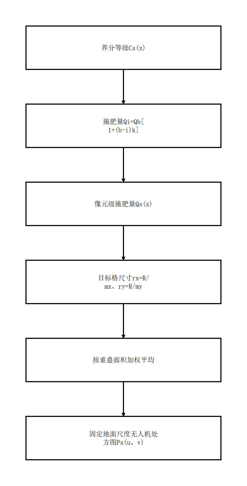

# 说明书摘要

本发明公开一种水稻养分遥感诊断无人机精准施肥的方法。该方法根据水稻生育期选择植被指数函数和诊断函数，由绿光、红光及近红外反射率连续计算植被指数和养分诊断值；对诊断范围内的有效诊断值求预设分位数，以相邻分位阈值形成养分等级；根据基准等级、基准施肥量和等级变化系数把养分等级转换为像元级施肥量；测量源坐标单位对应的真实地面距离，将目标处方格的米制边长换算为源坐标尺寸，并按照源像元与目标格的重叠面积对有效施肥量加权平均，得到无人机施肥处方图。该方法使生育期诊断、养分分级、施肥量计算和处方格构造具有连续且可复算的数学对应关系。

摘要附图：图2。

